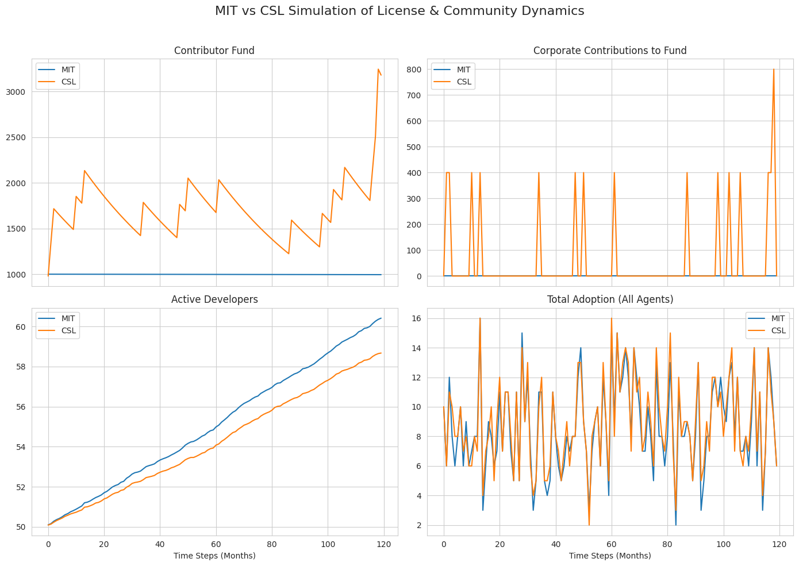
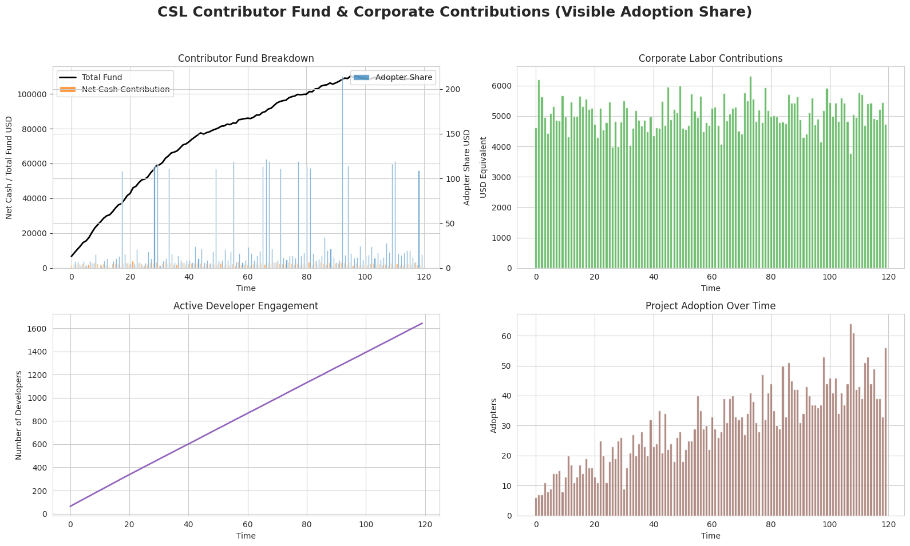

<h1 align="center">Common Sense License (CSL) v1.0</h1>

  

The Common Sense License (CSL) is a **source-available, ethical, and commons-oriented license** designed to:

- Keep software free for individuals, nonprofits, and cooperatives.
- Protect against extractive or exploitative corporate use.
- Encourage contributions back to a Commons Fund supporting open software projects.

---

## Key Features

1. **Ethical Use Restrictions:** Cannot be used for oppressive, surveillance, military, or extractive purposes.
2. **Reciprocity:** Large users must contribute ≥5% of net revenue or labor to the Commons Fund.
3. **Community Governance:** License changes and fund oversight are democratically managed.

---

## How to Use CSL

- Individuals and small organizations: automatically have rights under CSL v1.0.
- Large corporations: must sign a Community Use Agreement (CUA) to use the Software legally.
- All users must retain license and attribution in copies or derivatives.

---

## Sharing & Talking About CSL

- “CSL is an ethical, source-available license that protects the commons and requires large users to contribute back.”
- “It’s free for nonprofits and small businesses, but large corporations must share revenue or labor.”
- “CSL enforces ethical use and encourages community governance of open software.”

---

## Resources

- LICENSE.md → Full CSL text
- NOTICE.md → Maintainers, Commons Fund info, and attribution guidance
- COMMUNITY_USE_AGREEMENTS.md → Templates for nonprofits, small businesses, and large corporations

---

## Contribute

- Submit issues or pull requests for improvements to the license or Community Use Agreement templates.
- Join our community to help manage the Commons Fund.

# CSL Progressive Commons Notebooks

Explore how the Common Sense License (CSL) empowers engineers and ensures the software ecosystem prospers. These Colab-ready notebooks cover:

1. Fetching real npm download data.
2. Difference-in-differences (DID) regression analysis.
3. Agent-based simulation of adoption, fund growth, and active developers.
4. Parameter sweeps to explore policy impact.
5. Corporate cash and labor contribution modeling.
6. Storytelling visuals to communicate CSL impact.

  

  

